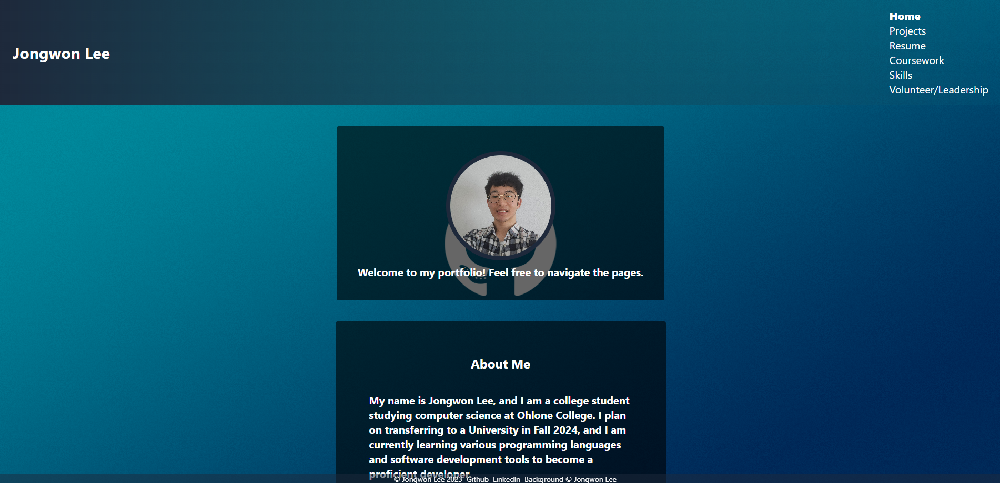

# React-Portfolio

Deployed page: [LINK](https://jongwonlee123.github.io/react-portfolio/)




## Description

A react application to showcase my portfolio of projects. Review my about page, check out my projects, or send me a message. Working on adding a resume soon.

## Table of Contents

- [Questions](#questions)
- [Usage](#usage)

## Usage
To run locally, - run ```npm i``` to download packages and then run ```npm start```.

## Questions

[Github: JongwonLee123](https://github.com/JongwonLee123)<br>
Email: jongwonlee12345@gmail.com
